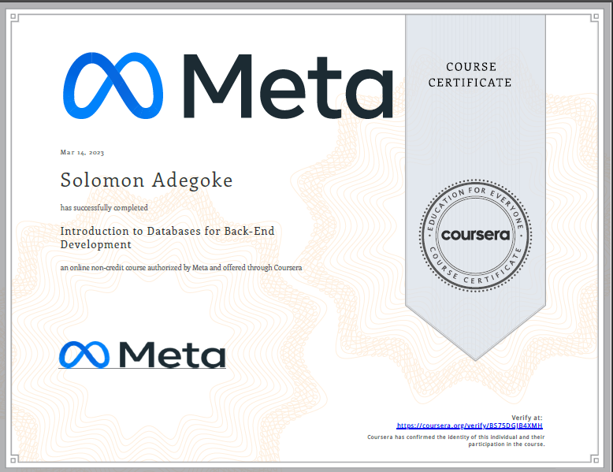

# Introduction to Databases for Back-End Development

- This directory contains all of my assignments from the Coursera Course: [Introduction to Databases for Back-End Development](https://www.coursera.org/learn/intro-to-databases-back-end-development?specialization=meta-back-end-developer)

## Table of Content

- Week 1: [Introduction to Databases](https://github.com/FelicityTech/Meta-Back-End_Dev/tree/main/Introduction%20to%20Databases%20for%20Back-End%20Development(MySQL)/Week%201%20-%20Introduction%20to%20Databases)
- Week 2: [Create, Read, Update and Delete (CRUD) Operations](https://github.com/FelicityTech/Meta-Back-End_Dev/tree/main/Introduction%20to%20Databases%20for%20Back-End%20Development(MySQL)/Week%202%20-%20Create%2C%20Read%2C%20Update%20and%20Delete%20(CRUD)%20Operations)
- Week 3: [SQL Operators and sorting and filtering data](https://github.com/FelicityTech/Meta-Back-End_Dev/tree/main/Introduction%20to%20Databases%20for%20Back-End%20Development(MySQL)/Week%203%20-%20SQL%20Operators%20and%20sorting%20and%20filtering%20data)
- Week 4: [Database design](https://github.com/FelicityTech/Meta-Back-End_Dev/tree/main/Introduction%20to%20Databases%20for%20Back-End%20Development(MySQL)/Week%204%20-%20Database%20design)
- Week 5: [Graded assessment](https://github.com/FelicityTech/Meta-Back-End_Dev/Course%204%20-%20Introduction%20to%20Databases%20for%20Back-End%20Development/Week%205%20-%20Graded%20assessment)

## Proof of Completion

